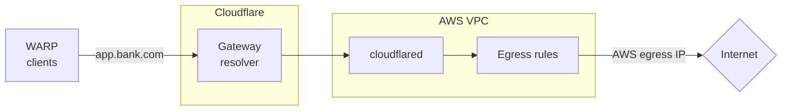

import { Details } from "~/components";

Cloudflare Tunnel can be used for source IP anchoring when you want to use existing egress IPs instead of purchasing [Cloudflare dedicated egress IPs](/cloudflare-one/policies/gateway/egress-policies/dedicated-egress-ips/). Some third-party websites may have an Access Control List (ACL) that only allow connections from certain source IPs. If you already a non-Cloudflare IP on their allowlist (such an egress IP provided by an ISP or a cloud provider like AWS), you can configure `cloudflared` to anchor user traffic to the same IPs that you use today.

For example, assume that your organization's banking service, `app.bank.com`, expects user traffic to come from an AWS IP. You can install `cloudflared` in your AWS envirionment and add a public hostname route pointing to `app.bank.com`. When users connect to `app.bank.com` using the WARP client, Gateway will route their traffic down the corresponding Cloudflare Tunnel to AWS. The traffic can then egress to the public Internet using your AWS egress IP.

## Prerequisites

## Configure a public hostname route
